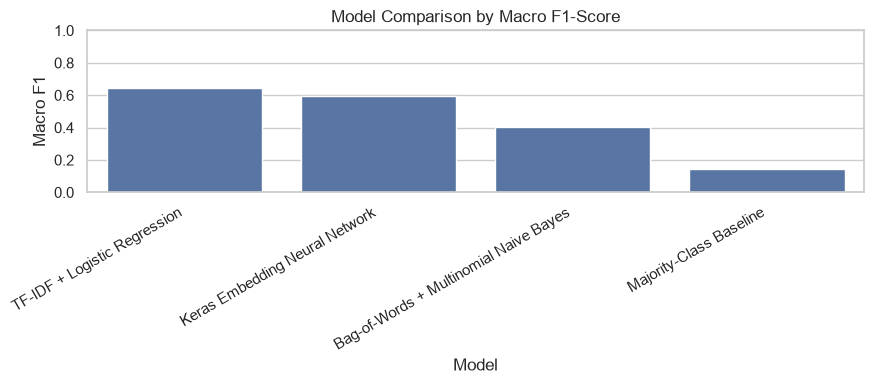
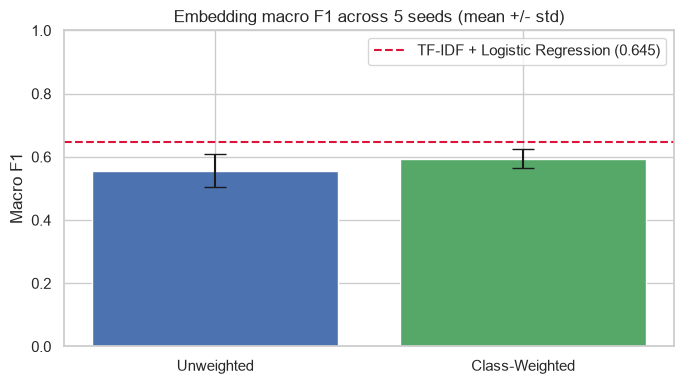
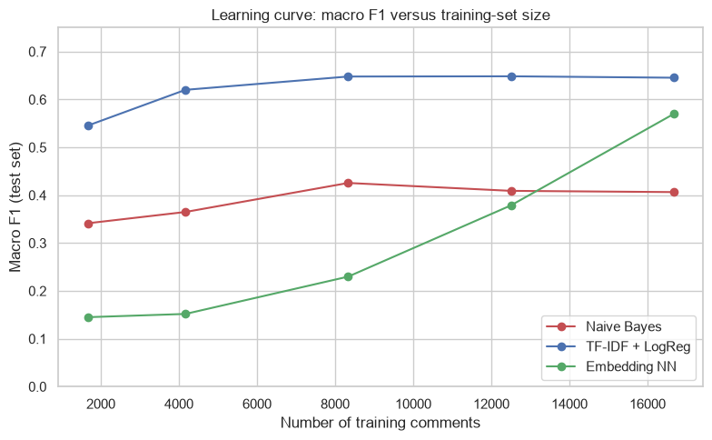
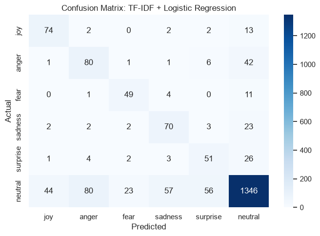

# Emotion Classification in Short Text

**Comparing statistical and neural NLP models on six emotions from GoEmotions.**

How much does model complexity help when most comments are neutral? This project compares sparse text features with learned embeddings, then examines class weighting, random initialisation and training-set size. The main finding is that the model with the highest accuracy is not the model with the strongest performance across all six classes.

[Explore the notebook](emotion_classification_goemotions.ipynb) · [Dataset source](https://github.com/google-research/google-research/tree/master/goemotions) · [Run locally](#run-locally)



## Results at a glance

The saved notebook reports the following single-run test results. Macro F1 gives equal weight to each class, which matters because approximately 77% of the test comments are neutral.

| Model | Accuracy | Macro F1 | Weighted F1 |
| --- | ---: | ---: | ---: |
| Majority-class baseline | 0.771 | 0.145 | 0.671 |
| Bag-of-words + Naive Bayes | 0.803 | 0.406 | 0.754 |
| TF-IDF + logistic regression | 0.801 | **0.645** | 0.812 |
| Keras embedding network, unweighted | **0.846** | 0.593 | **0.830** |

TF-IDF with class-balanced logistic regression provides the strongest macro F1 among these models. The unweighted neural model has higher accuracy, but performs less evenly across emotions. This is a comparison within this dataset and configuration, not a general claim that linear models outperform neural networks.

## Dataset and task

The project uses Google Research GoEmotions, retaining comments with exactly one label from **joy, anger, fear, sadness, surprise and neutral**. Comments with multiple labels or other emotions are excluded rather than relabelled.

| Original split retained | Filtered comments |
| --- | ---: |
| Training | 16,668 |
| Validation | 2,044 |
| Test | 2,084 |
| **Total** | **20,796** |

This six-class, single-label task differs from the original 28-label, multi-label benchmark. Scores should not be compared directly with published results on the full task.

## What the pipeline includes

- Data loading and label filtering with Hugging Face Datasets and pandas.
- Scikit-learn pipelines for bag-of-words Naive Bayes and TF-IDF logistic regression.
- A TensorFlow/Keras network with learned embeddings, average pooling, dropout and dense layers.
- Validation-based early stopping for neural training.
- Accuracy, macro and weighted F1, per-class reports, confusion matrices and error inspection.
- Class-weighting experiments, five-seed comparisons and learning curves.

## Does class weighting help?

Across five random seeds, the neural model's mean macro F1 increased from **0.557 ± 0.053** without weighting to **0.594 ± 0.030** with weighting. These are means and standard deviations across runs, not confidence intervals. The weighted model remained below the logistic-regression reference in this experiment.



The notebook also contains a separate weighted single run. The averages above are more useful for understanding variation than choosing the best individual run.

## How performance changes with more data

TF-IDF logistic regression reaches around 0.65 macro F1 with half the training data. The embedding model improves as more examples are added, but does not overtake it within the observed range. The neural learning curve averages three seeds per training-set size.



## Looking beyond the headline score

Confusion matrices and misclassified examples expose errors involving ambiguous language, sarcasm and minority classes. This helps explain why overall accuracy alone can hide weaknesses.



## Run locally

Create a Python virtual environment from the repository root. On Windows PowerShell:

```powershell
python -m venv .venv
.\.venv\Scripts\python.exe -m pip install -r requirements.txt
.\.venv\Scripts\python.exe -m pip install jupyterlab
.\.venv\Scripts\python.exe -m jupyter lab
```

Open `emotion_classification_goemotions.ipynb` and run the cells in order. An internet connection is needed to download the dataset on the first run. The multi-seed experiments and learning curves train several neural models and take longer than the initial comparison.

Dependencies are currently unpinned. TensorFlow compatibility depends on the Python version and platform, and exact results can vary between environments. This README update uses the existing saved outputs; it does not represent a fresh training run.

## Limitations

- Results concern one filtered English Reddit dataset and do not establish performance on other domains or languages.
- Filtering removes multi-label examples and changes the original emotion-classification task.
- Neural results vary with initialisation and numerical execution, even with seeds set.
- The notebook repeatedly evaluates variants and learning curves on the same test split. A new untouched holdout would strengthen future confirmatory evaluation.
- The embedding model is trained from scratch. Pretrained transformers are not evaluated.
- Labels describe annotated text, not a reliable assessment of a person's internal emotional state.

## Repository guide

| File | Contents |
| --- | --- |
| [`emotion_classification_goemotions.ipynb`](emotion_classification_goemotions.ipynb) | Methods, code, saved results, plots, error analysis and references |
| [`requirements.txt`](requirements.txt) | Python dependencies |
| [`docs/images/`](docs/images/) | Original charts extracted from the saved notebook outputs |

Built with **Python · pandas · scikit-learn · TensorFlow/Keras · Hugging Face Datasets · Matplotlib · Seaborn**.
